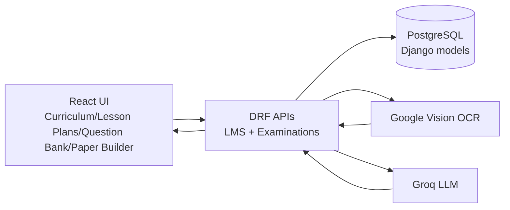
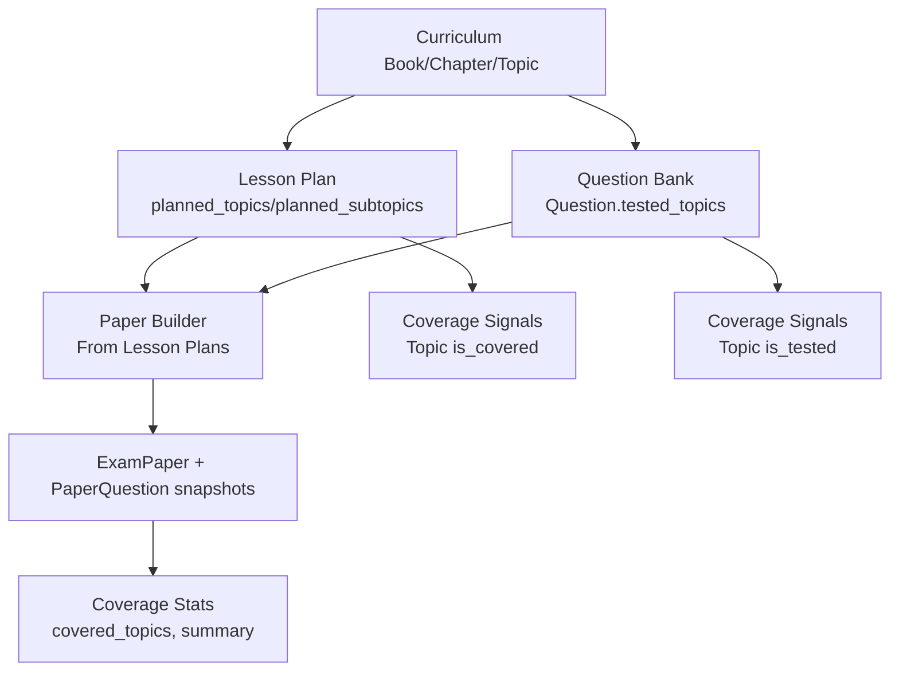

# Curriculum, Lesson Plans, Question Bank, and Paper Builder

Audience: Senior developers onboarding to the curriculum-to-assessment pipeline.
Scope: `/academics/curriculum`, `/academics/lesson-plans`, `/academics/questions`, `/academics/paper-builder`.

---

## 1. System Data Flow

### 1.1 End-to-end architecture flow

### 1.2 Cross-module business flow

### 1.3 Practical user flows

1. Curriculum authoring:
- Teacher/admin selects class + subject in `/academics/curriculum`.
- Creates books, chapters, topics manually or via TOC import.
- TOC import supports text parse, AI suggestions, OCR extraction, and apply-to-book commit.

2. Lesson planning:
- Teacher creates lesson plan for class/subject/date.
- Selects `planned_topic_ids` and optionally `planned_subtopic_ids`.
- Publish action changes status and can trigger student notifications.

3. Question bank build:
- Teacher creates reusable questions and links each question to curriculum topics via `tested_topics`.
- Questions become searchable/filterable by class-subject-curriculum context.

4. Paper generation:
- Manual mode: creates/updates a server draft (`ensure-draft` + `autosave`) and attaches questions.
- Image mode: OCR extracts handwritten questions and confirms into paper/questions.
- Lesson-plan mode: selects lesson plans, optionally AI-generates topic-aligned questions, then creates paper from linked plans + available topic questions.

---

## 2. Backend Schema (Core Models)

## 2.1 LMS (curriculum + lesson plans)

### `lms.Book`
- `school` (FK)
- `class_obj` (FK -> students.Class)
- `subject` (FK -> academics.Subject)
- `title`, `author`, `publisher`, `edition`, `language`, `description`
- `is_active`, `created_at`, `updated_at`

### `lms.Chapter`
- `book` (FK)
- `title`, `chapter_number`
- `page_start`, `page_end`, `description`
- Rich content fields: `content_blocks`, `content_text`, schema/version flags
- `is_active`, timestamps

### `lms.Topic`
- `chapter` (FK)
- `title`, `topic_number`
- `page_start`, `page_end`, `content_kind`, `description`
- Rich content fields: `content_blocks`, `content_text`, schema/version flags
- `estimated_periods`, `is_active`, timestamps
- Computed properties:
  - `is_covered` via `lesson_plans`
  - `is_tested` via `test_questions`
  - `test_question_count`
  - `lesson_plan_count`

### `lms.SubTopic`
- `topic` (FK)
- `title`, `subtopic_number`, `description`
- Content fields: `content_text`, `content_blocks_json`, `content_schema_version`
- Time estimate: `estimated_minutes`
- `is_active`, timestamps

### `lms.ContentBlock`
- Hierarchical parent link: at least one of `chapter`/`topic`/`subtopic`
- `block_type`, `content_text`, `content_rich`
- `sequence_order`, `difficulty_level`, `estimated_minutes`
- Intelligence fields: `embedding`, `is_ai_generated`
- `is_active`, timestamps

### `lms.ContentRevision`
- `content_block` (FK)
- Snapshot fields: `content_text`, `content_rich`
- Audit fields: `changed_by`, `changed_at`, `revision_note`

### `lms.Tag` + link models
- `Tag`: `name`, `tag_type`, optional `subject`, optional `school`
- `ContentBlockTag`: link table (`content_block`, `tag`)
- `QuestionTag`: link table (`question`, `tag`)

### `lms.LearningObjective` + link model
- `LearningObjective`: topic-scoped objective with `code`, `description`, optional `bloom_level`, `is_active`
- `LessonPlanObjective`: bridge model (`lesson_plan`, `objective`)

### `lms.CurriculumStandard` alignment models
- `CurriculumStandard`: `name`, `country`, `board`
- `StandardObjective`: `standard`, `subject`, `grade`, `code`, `statement`
- `TopicStandardAlignment`: bridge model (`topic`, `objective`)

### `lms.LessonPlan`
- `school`, `academic_year`, `class_obj`, `subject`, `teacher` (FKs)
- Core fields: `title`, `description`, `objectives`, `lesson_date`, `duration_minutes`
- Delivery fields: `materials_needed`, `teaching_methods`
- Curriculum links:
  - `planned_topics` (M2M -> `lms.Topic`)
  - `planned_subtopics` (M2M -> `lms.SubTopic`)
- Mode/meta: `display_text`, `content_mode` (`TOPICS`/`FREEFORM`), `ai_generated`
- Workflow: `status` (`DRAFT`/`PUBLISHED`), `is_active`, timestamps

### `lms.LessonAttachment`
- `lesson` (FK)
- `file_url`, `file_name`, `attachment_type`, `uploaded_at`

### `lms.TOCImportJob`
- Async OCR status/payload for TOC import polling (`/api/lms/toc-jobs/{job_id}/`).

## 2.2 Examinations (question bank + paper builder)

### `examinations.Question`
- `school`, `subject`, `exam_type` (FKs)
- Content fields: `question_text`, `question_image_url`
- Classification: `question_type`, `difficulty_level`, `bloom_level`, `marks`
- MCQ fields: `option_a`..`option_d`, `correct_answer`
- Subjective fields: `answer_text`, `type_data` (JSON)
- Curriculum linkage: `tested_topics` (M2M -> `lms.Topic`)
- Source/AI metadata: `source_content_block`, `is_ai_generated`, `verified_by`, `verified_at`
- Embeddings/analytics: `embedding`, `paper_use_count`, `last_used_in`, `last_used_at`
- Metadata: `created_by`, `is_active`, timestamps

### `examinations.QuestionRevision`
- `question` (FK)
- Snapshot fields: `question_text`, `snapshot`
- Audit fields: `changed_by`, `changed_at`

### `examinations.ExamPaper`
- `school`, `exam`, `exam_subject`, `class_obj`, `subject` (FKs)
- Metadata: `paper_title`, `instructions`, `total_marks`, `duration_minutes`
- Questions: M2M through `PaperQuestion`
- Curriculum alignment: `lesson_plans` (M2M -> `lms.LessonPlan`)
- Workflow: `status` (`DRAFT`/`READY`/`PUBLISHED`), `generated_by`, `is_active`, timestamps
- Computed:
  - `covered_topics`
  - `question_topics_summary`

### `examinations.PaperQuestion` (through model)
- `exam_paper` (FK), `question` (FK)
- `question_order`, `marks_override`
- `question_snapshot` (frozen JSON of question at attach/save time)
- Unique: `(exam_paper, question)`

### `examinations.StudentResponse`
- `student`, `question`, `exam_paper` (FKs)
- `response_text`, `marks_awarded`, `is_correct`, `time_taken_seconds`, `submitted_at`
- Unique: `(student, question, exam_paper)`

### `examinations.QuestionStats`
- One-to-one with `Question`
- `attempt_count`, `correct_count`, `avg_time_seconds`
- Computed intelligence: `real_difficulty`, `last_computed_at`

### `examinations.PaperUpload`
- Stores uploaded paper image and OCR extraction lifecycle.

---

## 3. Frontend Visible Fields

## 3.1 Curriculum page (`/academics/curriculum`)

Primary filters:
- `Class`
- `Subject`

Book card and detail fields:
- `title`, `author`, `publisher`, `edition`, `language`, `description`
- `chapter_count`
- Syllabus progress (`covered_topics / total_topics`)

Book modal fields:
- `Title` (required)
- `Author`
- `Publisher`
- `Edition`
- `Language`
- `Description`

Chapter modal fields:
- `Title` (required)
- `Chapter Number`
- `Description`

Topic modal fields:
- `Title` (required)
- `Topic Number`
- `Estimated Periods`
- `Description`

Topic row indicators:
- Coverage badge (`is_covered`)
- Testing badge (`is_tested`)
- Question count badge (`test_question_count`)

TOC import (wizard/modal) visible capabilities:
- Input modes: image upload/camera and text paste
- Parse/build operations: parse TOC, AI suggest, apply TOC
- OCR line mapping and labeling (chapter/topic/note)
- Structure review and final apply-to-book commit

## 3.2 Lesson Plans page (`/academics/lesson-plans`)

Filters:
- `Class`, `Subject`, `Search`
- Export date range (`from`, `to`) for PDF download

List columns/cards:
- `Title`, `Description`
- `Class`, `Subject`, `Teacher`
- `Lesson Date`, `Duration`
- `Status` (`DRAFT`/`PUBLISHED`)
- Topic chips (`planned_topics` preview)
- AI marker (`ai_generated`)

Create/Edit form fields:
- `Title` (required)
- `Class` (required)
- `Subject` (required)
- `Teacher`
- `Lesson Date`
- `Duration (minutes)`
- `Status`
- `Description`
- `Objectives`
- `Materials Needed`
- `Teaching Methods`

Wizard-based creation (`LessonPlanWizard`) additional behavior:
- Step-driven class/date -> topic selection -> AI assist -> review/save
- Topic and sub-topic selection from curriculum tree
- `content_mode` (`TOPICS`/`FREEFORM`)

## 3.3 Question Bank page (`/academics/questions`)

Filters:
- `Class`, `Subject`, `Book`, `Chapter`, topic filter context
- `Question Type`, `Difficulty`, `Search`

Question card visible fields:
- `question_text`
- `question_type`
- `difficulty_level`
- `marks`
- topic count (`tested_topics.length`)
- answer previews (MCQ options, true/false answer, model answer)

Add/Edit modal fields:
- Context: `Class`, `Subject`, `Book`, `Chapter`
- Core: `Question Text` (required), `Type`, `Difficulty`, `Marks`
- Type-specific:
  - MCQ: options A-D + `correct_answer`
  - True/False: `correct_answer`
  - Fill in blank: accepted answers text
  - Short/Long/Essay: model answer
  - Matching: left/right items + pairs
- Curriculum linkage: topic picker (`tested_topics`)

## 3.4 Paper Builder page (`/academics/paper-builder`)

Implemented as a 3-step wizard (`QuestionPaperBuilderPage.jsx`), not top-level tabs —
"tabs" only appear once, as a one-time source picker inside step 3.

Step 1: Paper Setup
- `Class` (required), `Subject` (required), `Exam` (optional)
- `paper_title` (auto-suggested as "Exam - Class - Subject" until the user types
  their own), `total_marks`, `duration_minutes`, `instructions`
- Answer-lines export toggle (`render_options.answer_lines`)
- Shortcut into image-capture mode directly from this step

Step 2: Paper Structure
- Section-by-section builder (`PaperStructureBuilder`): `question_type`,
  `slots_shown`/`slots_counted` (supports choice questions, e.g. "answer 3 of 5"),
  `marks_per_question` per section
- Allocated-vs-total marks mismatch is advisory: a confirm dialog on "Next," not a
  hard block. The mismatch is also persisted server-side as `marks_reconciled` on
  the paper (see 4.4), so a dismissed/skipped confirm still surfaces later.

Step 3: Add Questions + Coverage
- One-time source picker (mutually exclusive per session): **Type manually**
  (`ManualEntryPaperTab`), **From question bank / lesson plans** (`BankFillSource`),
  or **Capture from image** (`ImageCapturePaperTab`)
- Question editor fields: `question_text`, `question_type`, `difficulty_level`,
  `marks`, type-specific options/answers
- Curriculum Coverage sidebar: SLO coverage %, covered/uncovered SLO lists, and a
  Bloom's-taxonomy distribution chart (warns above 70% Remember/Understand) — all
  rendered from the single `coverage_stats` response (see 4.4), no per-lesson-plan
  or per-topic fan-out
- Marks-mismatch warning banner (from `marks_reconciled`) surfaces here too

Persistence is draft-first, not standard create/update: `ensure-draft` creates the
`ExamPaper` row lazily once class+subject+title exist client-side, then `autosave`
debounces (900ms) on every edit. Coverage stats refetch after each successful
autosave rather than on a timer.

---

## 4. APIs Used (by feature)

Base prefixes:
- LMS: `/api/lms/...`
- Examinations: `/api/examinations/...`

## 4.1 Curriculum (`/academics/curriculum`)

Books/chapters/topics:
- `GET/POST /api/lms/books/`
- `GET/PATCH/DELETE /api/lms/books/{id}/`
- `GET /api/lms/books/{id}/tree/`
- `GET /api/lms/books/for_class_subject/?class_id=&subject_id=`
- `GET /api/lms/books/syllabus_progress/?class_id=&subject_id=`
- `GET/POST /api/lms/chapters/`
- `GET/POST /api/lms/topics/`
- `GET/POST /api/lms/subtopics/`

Content intelligence APIs:
- `GET/POST /api/lms/content-blocks/`
- `GET/PATCH/DELETE /api/lms/content-blocks/{id}/`
- `GET /api/lms/content-blocks/{id}/revisions/`
- `POST /api/lms/content-blocks/{id}/restore/?revision_id=`
- `POST /api/lms/content-blocks/{id}/add_tag/`
- `GET /api/lms/content-blocks/semantic_search/?q=&limit=`
- `GET/POST /api/lms/tags/`
- `GET/PATCH/DELETE /api/lms/tags/{id}/`

Objective/standards APIs:
- `GET /api/lms/topics/{id}/objectives/`
- `GET /api/lms/topics/{id}/standards/`

TOC import pipeline:
- `POST /api/lms/books/{id}/parse_toc/`
- `POST /api/lms/books/{id}/parse_toc_stream/`
- `POST /api/lms/books/{id}/suggest_toc/`
- `POST /api/lms/books/{id}/apply_toc/`
- `POST /api/lms/books/{id}/ocr_toc/` (sync)
- `POST /api/lms/books/{id}/ocr_toc/?async=1` (job-based)
- `GET /api/lms/toc-jobs/{job_id}/`

## 4.2 Lesson Plans (`/academics/lesson-plans`)

Core CRUD/workflow:
- `GET/POST /api/lms/lesson-plans/`
- `GET/PATCH/DELETE /api/lms/lesson-plans/{id}/`
- `GET /api/lms/lesson-plans/by_class/?class_id=`
- `POST /api/lms/lesson-plans/bulk_create/`
- `POST /api/lms/lesson-plans/{id}/publish/`
- `POST /api/lms/lesson-plans/{id}/link_objectives/`

AI generation:
- `POST /api/lms/generate-lesson-plan/`
- Returns `ai_job_id` for audit/acceptance tracking

## 4.3 Question Bank (`/academics/questions`)

Question management:
- `GET/POST /api/examinations/questions/`
- `GET/PATCH/DELETE /api/examinations/questions/{id}/`
- Filters commonly used: `class_id`, `subject`, `book_id`, `chapter_id`, `topic_id`, `question_type`, `difficulty_level`, `bloom_level`, `tag_id`, `search`, `ordering=paper_use_count`
- Actions:
  - `POST /api/examinations/questions/{id}/add_tag/`
  - `GET /api/examinations/questions/semantic_search/?q=&limit=`

Lesson-plan linked question operations:
- `GET /api/examinations/questions/by_lesson_plan/?lesson_plan_id=`
- `POST /api/examinations/questions/generate_from_lesson/`
- AI generation returns `ai_job_id` for audit/acceptance tracking

## 4.4 Paper Builder (`/academics/paper-builder`)

Draft/manual flow:
- `POST /api/examinations/exam-papers/ensure-draft/`
- `POST /api/examinations/exam-papers/{id}/autosave/`
- `GET /api/examinations/exam-papers/{id}/` (resume/read, includes `overused_questions` warning list where `paper_use_count > 3`, and `marks_reconciled` — whether `structure_marks_total` matches `total_marks`, computed server-side so a dismissed/skipped client-side mismatch confirm still shows up here)

Paper CRUD and lesson-plan alignment:
- `GET/POST /api/examinations/exam-papers/`
- `GET/PATCH/DELETE /api/examinations/exam-papers/{id}/`
- `POST /api/examinations/exam-papers/create_from_lessons/`
- `POST /api/examinations/exam-papers/{id}/link_lesson_plans/`
- `GET /api/examinations/exam-papers/{id}/coverage_stats/`
  - Coverage stats include `slo_coverage_count`
  - `planned_topics_coverage`: every topic planned across the paper's linked lesson
    plans, each with its SLOs and an `is_covered` flag — computed in one query so
    the frontend coverage panel doesn't fan out one request per lesson plan plus
    one per topic (`Topic.objects.filter(lesson_plans__in=...)`, prefetching
    `standard_alignments__objective`)

Export/review:
- `GET /api/examinations/exam-papers/{id}/generate-pdf/`
- `GET /api/examinations/exam-papers/{id}/generate-docx/`
- `POST /api/examinations/exam-papers/review-questions/`

OCR paper capture flow:
- `POST /api/examinations/paper-uploads/upload-image/`
- `GET /api/examinations/paper-uploads/{id}/`
- `POST /api/examinations/paper-uploads/{id}/confirm/`

## 4.5 Assessment Feedback Loop

- `POST /api/examinations/student-responses/` (bulk submit per student + paper)
- `GET /api/examinations/student-responses/` (query by paper/student/question)
- Submission triggers async `recompute_question_stats(question_id)` to update `QuestionStats`

---

## 5. Senior-Developer Notes

1. Curriculum is the source-of-truth taxonomy.
- `Book -> Chapter -> Topic -> SubTopic` drives both planning and assessment alignment.

2. Coverage analytics are relational, not duplicated.
- Teaching coverage comes from `LessonPlan.planned_topics`.
- Testing coverage comes from `Question.tested_topics` and `ExamPaper` composition.

3. Paper builder supports two persistence patterns.
- Standard create/update flow for finalized paper data.
- Draft-first flow (`ensure-draft` + `autosave`) with question snapshots for safe iterative editing.

4. OCR has two distinct tracks.
- Curriculum TOC OCR (`/lms/books/{id}/ocr_toc/`) for structure ingestion.
- Exam paper OCR (`/examinations/paper-uploads/upload-image/`) for question extraction.

5. Multi-tenant and teacher-scope filtering is enforced in viewsets.
- Querysets are tenant-scoped and teacher-scoped by class-subject assignment; this is critical when extending APIs.
- Exam-paper write access (`ensure_draft`, `autosave`, `create_from_lessons`) all route through one `_can_manage_exam_papers(request, class_id, subject_id, school_id)` helper: a teacher may manage a paper for (class, subject) as the class's homeroom class-teacher (all subjects) OR as the subject-teacher specifically assigned to that class-subject pairing — the same dual-layer scope `_apply_teacher_exam_scope` already uses for read access. Both branches must stay wired in; the `subject_id` branch was previously dead code, which wrongly blocked legitimate subject-only teachers from managing their own papers.

6. Route mapping for requested pages.
- `/academics/curriculum` -> `CurriculumPage.jsx`
- `/academics/lesson-plans` -> `LessonPlansPage.jsx`
- `/academics/questions` -> `QuestionsPage.jsx`
- `/academics/paper-builder` -> `QuestionPaperBuilderPage.jsx`

7. Intelligence and audit surfaces are now first-class.
- AI generation endpoints return `ai_job_id` and can be reviewed/accepted through the central AI job flow.
- Curriculum and questions support semantic search over embeddings.
- Content and question editing now keeps revision history for restore and traceability.
