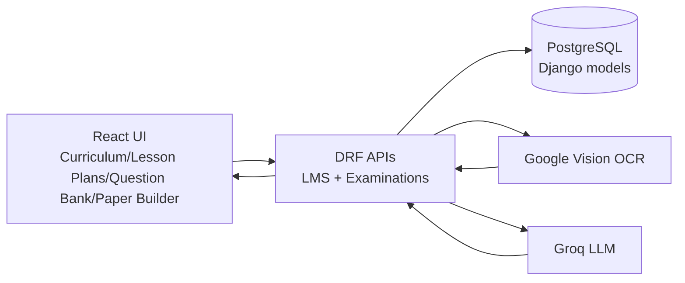
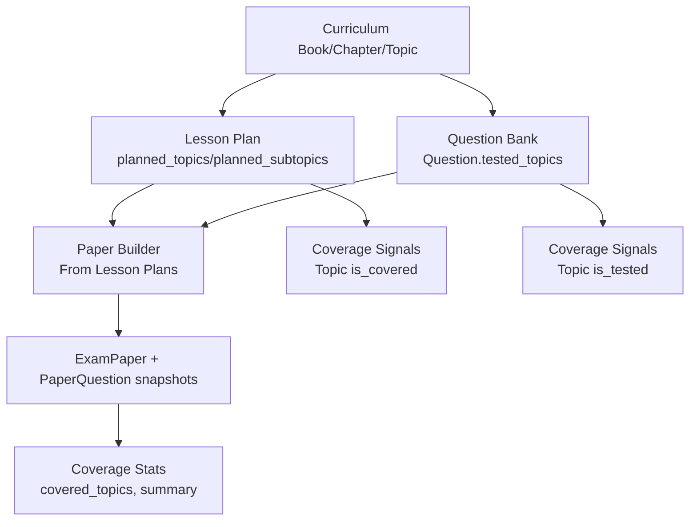

# Curriculum, Lesson Plans, Question Bank, and Paper Builder

Audience: Senior developers onboarding to the curriculum-to-assessment pipeline.
Scope: `/academics/curriculum`, `/academics/lesson-plans`, `/academics/questions`, `/academics/paper-builder`.

---

## 1. System Data Flow

### 1.1 End-to-end architecture flow

### 1.2 Cross-module business flow

### 1.3 Practical user flows

1. Curriculum authoring:
- Teacher/admin selects class + subject in `/academics/curriculum`.
- Creates books, chapters, topics manually or via TOC import.
- TOC import supports text parse, AI suggestions, OCR extraction, and apply-to-book commit.

2. Lesson planning:
- Teacher creates lesson plan for class/subject/date.
- Selects `planned_topic_ids` and optionally `planned_subtopic_ids`.
- Publish action changes status and can trigger student notifications.

3. Question bank build:
- Teacher creates reusable questions and links each question to curriculum topics via `tested_topics`.
- Questions become searchable/filterable by class-subject-curriculum context.

4. Paper generation:
- Manual mode: creates/updates a server draft (`ensure-draft` + `autosave`) and attaches questions.
- Image mode: OCR extracts handwritten questions and confirms into paper/questions.
- Lesson-plan mode: selects lesson plans, optionally AI-generates topic-aligned questions, then creates paper from linked plans + available topic questions.

---

## 2. Backend Schema (Core Models)

## 2.1 LMS (curriculum + lesson plans)

### `lms.Book`
- `school` (FK)
- `class_obj` (FK -> students.Class)
- `subject` (FK -> academics.Subject)
- `title`, `author`, `publisher`, `edition`, `language`, `description`
- `is_active`, `created_at`, `updated_at`

### `lms.Chapter`
- `book` (FK)
- `title`, `chapter_number`
- `page_start`, `page_end`, `description`
- Rich content fields: `content_blocks`, `content_text`, schema/version flags
- `is_active`, timestamps

### `lms.Topic`
- `chapter` (FK)
- `title`, `topic_number`
- `page_start`, `page_end`, `content_kind`, `description`
- Rich content fields: `content_blocks`, `content_text`, schema/version flags
- `estimated_periods`, `is_active`, timestamps
- Computed properties:
  - `is_covered` via `lesson_plans`
  - `is_tested` via `test_questions`
  - `test_question_count`
  - `lesson_plan_count`

### `lms.SubTopic`
- `topic` (FK)
- `title`, `subtopic_number`, `description`
- Content fields: `content_text`, `content_blocks_json`, `content_schema_version`
- Time estimate: `estimated_minutes`
- `is_active`, timestamps

### `lms.ContentBlock`
- Hierarchical parent link: at least one of `chapter`/`topic`/`subtopic`
- `block_type`, `content_text`, `content_rich`
- `sequence_order`, `difficulty_level`, `estimated_minutes`
- Intelligence fields: `embedding`, `is_ai_generated`
- `is_active`, timestamps

### `lms.ContentRevision`
- `content_block` (FK)
- Snapshot fields: `content_text`, `content_rich`
- Audit fields: `changed_by`, `changed_at`, `revision_note`

### `lms.Tag` + link models
- `Tag`: `name`, `tag_type`, optional `subject`, optional `school`
- `ContentBlockTag`: link table (`content_block`, `tag`)
- `QuestionTag`: link table (`question`, `tag`)

### `lms.LearningObjective` + link model
- `LearningObjective`: topic-scoped objective with `code`, `description`, optional `bloom_level`, `is_active`
- `LessonPlanObjective`: bridge model (`lesson_plan`, `objective`)

### `lms.CurriculumStandard` alignment models
- `CurriculumStandard`: `name`, `country`, `board`
- `StandardObjective`: `standard`, `subject`, `grade`, `code`, `statement`
- `TopicStandardAlignment`: bridge model (`topic`, `objective`)

### `lms.LessonPlan`
- `school`, `academic_year`, `class_obj`, `subject`, `teacher` (FKs)
- Core fields: `title`, `description`, `objectives`, `lesson_date`, `duration_minutes`
- Delivery fields: `materials_needed`, `teaching_methods`
- Curriculum links:
  - `planned_topics` (M2M -> `lms.Topic`)
  - `planned_subtopics` (M2M -> `lms.SubTopic`)
- Mode/meta: `display_text`, `content_mode` (`TOPICS`/`FREEFORM`), `ai_generated`
- Workflow: `status` (`DRAFT`/`PUBLISHED`), `is_active`, timestamps

### `lms.LessonAttachment`
- `lesson` (FK)
- `file_url`, `file_name`, `attachment_type`, `uploaded_at`

### `lms.TOCImportJob`
- Async OCR status/payload for TOC import polling (`/api/lms/toc-jobs/{job_id}/`).

## 2.2 Examinations (question bank + paper builder)

### `examinations.Question`
- `school`, `subject`, `exam_type` (FKs)
- Content fields: `question_text`, `question_image_url`
- Classification: `question_type`, `difficulty_level`, `bloom_level`, `marks`
- MCQ fields: `option_a`..`option_d`, `correct_answer`
- Subjective fields: `answer_text`, `type_data` (JSON)
- Diagram Mode: `option_a_image_url`..`option_d_image_url`, `answer_image_url` (all
  nullable, alongside `question_image_url` above) — a drawn/pasted figure per slot,
  written only via `POST /questions/{id}/diagram/` (see 4.4 and `DiagramCanvas.jsx`).
  `answer_image_url` has no export consumer yet, same as `answer_text`.
- Curriculum linkage: `tested_topics` (M2M -> `lms.Topic`)
- Source/AI metadata: `source_content_block`, `is_ai_generated`, `verified_by`, `verified_at`
- Embeddings/analytics: `embedding`, `paper_use_count`, `last_used_in`, `last_used_at`
- Metadata: `created_by`, `is_active`, timestamps

### `examinations.QuestionRevision`
- `question` (FK)
- Snapshot fields: `question_text`, `snapshot`
- Audit fields: `changed_by`, `changed_at`

### `examinations.ExamPaper`
- `school`, `exam`, `exam_subject`, `class_obj`, `subject` (FKs)
- Metadata: `paper_title`, `instructions`, `total_marks`, `duration_minutes`
- Questions: M2M through `PaperQuestion`
- Curriculum alignment: `lesson_plans` (M2M -> `lms.LessonPlan`)
- Workflow: `status` (`DRAFT`/`READY`/`PUBLISHED`), `generated_by`, `is_active`, timestamps
- Computed:
  - `covered_topics`
  - `question_topics_summary`

### `examinations.PaperQuestion` (through model)
- `exam_paper` (FK), `question` (FK)
- `question_order`, `marks_override`
- `question_snapshot` (frozen JSON of question at attach/save time)
- Unique: `(exam_paper, question)`

### `examinations.StudentResponse`
- `student`, `question`, `exam_paper` (FKs)
- `response_text`, `marks_awarded`, `is_correct`, `time_taken_seconds`, `submitted_at`
- Unique: `(student, question, exam_paper)`

### `examinations.QuestionStats`
- One-to-one with `Question`
- `attempt_count`, `correct_count`, `avg_time_seconds`
- Computed intelligence: `real_difficulty`, `last_computed_at`

### `examinations.PaperUpload`
- Stores uploaded paper image and OCR extraction lifecycle.

### `examinations.Worksheet` (NEW — 2026-09)
- `school`, `class_obj` (FKs), `subject` (FK, **nullable** — cross-subject/general worksheets allowed)
- Metadata: `title`, `instructions`, `tested_topics` (M2M -> `lms.Topic`)
- `structure`, `render_options` (JSON) — **same shape as `ExamPaper.structure`/`render_options`**, so PDF/DOCX export shares its section/numbering logic with the paper builder via `paper_export_layout._build_blocks()` instead of duplicating it
- Questions: M2M through `WorksheetItem`
- Workflow: `status` (`DRAFT`/`READY`/`PUBLISHED`), `source` (`MANUAL`/`SCAN`/`BANK`), `created_by`, `is_active`, timestamps
- **Deliberately has no `exam`/`exam_subject`/`total_marks`/`duration_minutes`** — a worksheet carries no exam-lifecycle or grading semantics; this is a sibling model of `ExamPaper`, not a special case of it. No answer-key export either (scoped out — worksheets are usually ungraded).

### `examinations.WorksheetItem` (through model, NEW — 2026-09)
- `worksheet` (FK), `question` (FK -> `examinations.Question`, the same bank question model — no separate worksheet-only question type)
- `item_order`, `section_key`, `marks_override` (nullable)
- `item_snapshot` (frozen JSON, same pattern as `PaperQuestion.question_snapshot`)
- Unique: `(worksheet, question)`
- Field names and `get_marks()`/`get_question_data()` methods deliberately mirror `PaperQuestion` so the shared export-layout code can treat either model's rows identically.

### `examinations.WorksheetUpload` (NEW — 2026-09)
- Stores uploaded worksheet images and OCR extraction lifecycle — same shape as `PaperUpload`, kept as a separate model rather than a nullable `worksheet` FK bolted onto it (would blur exam-paper capture and worksheet capture in one table).
- The OCR extraction itself (`PaperOCRProcessor`) is fully shared with the paper builder's scan pipeline; only this model and its Celery task (`process_worksheet_upload_ocr`) differ, and skip the multi-page continuation-context building `process_paper_upload_ocr` does (worksheets are almost always single-page).

---

## 3. Frontend Visible Fields

## 3.1 Curriculum page (`/academics/curriculum`)

Primary filters:
- `Class`
- `Subject`

Book card and detail fields:
- `title`, `author`, `publisher`, `edition`, `language`, `description`
- `chapter_count`
- Syllabus progress (`covered_topics / total_topics`)

Book modal fields:
- `Title` (required)
- `Author`
- `Publisher`
- `Edition`
- `Language`
- `Description`

Chapter modal fields:
- `Title` (required)
- `Chapter Number`
- `Description`

Topic modal fields:
- `Title` (required)
- `Topic Number`
- `Estimated Periods`
- `Description`

Topic row indicators:
- Coverage badge (`is_covered`)
- Testing badge (`is_tested`)
- Question count badge (`test_question_count`)

TOC import (wizard/modal) visible capabilities:
- Input modes: image upload/camera and text paste
- Parse/build operations: parse TOC, AI suggest, apply TOC
- OCR line mapping and labeling (chapter/topic/note)
- Structure review and final apply-to-book commit

## 3.2 Lesson Plans page (`/academics/lesson-plans`)

Filters:
- `Class`, `Subject`, `Search`
- Export date range (`from`, `to`) for PDF download

List columns/cards:
- `Title`, `Description`
- `Class`, `Subject`, `Teacher`
- `Lesson Date`, `Duration`
- `Status` (`DRAFT`/`PUBLISHED`)
- Topic chips (`planned_topics` preview)
- AI marker (`ai_generated`)

Create/Edit form fields:
- `Title` (required)
- `Class` (required)
- `Subject` (required)
- `Teacher`
- `Lesson Date`
- `Duration (minutes)`
- `Status`
- `Description`
- `Objectives`
- `Materials Needed`
- `Teaching Methods`

Wizard-based creation (`LessonPlanWizard`) additional behavior:
- Step-driven class/date -> topic selection -> AI assist -> review/save
- Topic and sub-topic selection from curriculum tree
- `content_mode` (`TOPICS`/`FREEFORM`)

## 3.3 Question Bank page (`/academics/questions`)

Filters:
- `Class`, `Subject`, `Book`, `Chapter`, topic filter context
- `Question Type`, `Difficulty`, `Search`

Question card visible fields:
- `question_text`
- `question_type`
- `difficulty_level`
- `marks`
- topic count (`tested_topics.length`)
- answer previews (MCQ options, true/false answer, model answer)

Add/Edit modal fields:
- Context: `Class`, `Subject`, `Book`, `Chapter`
- Core: `Question Text` (required), `Type`, `Difficulty`, `Marks`
- Type-specific:
  - MCQ: options A-D + `correct_answer`
  - True/False: `correct_answer`
  - Fill in blank: accepted answers text
  - Short/Long/Essay: model answer
  - Matching: left/right items + pairs
- Curriculum linkage: topic picker (`tested_topics`)

## 3.4 Paper Builder page (`/academics/paper-builder`)

Implemented as a 3-step wizard (`QuestionPaperBuilderPage.jsx`), not top-level tabs —
"tabs" only appear once, as a one-time source picker inside step 3. Notifications use
the shared `useToast()` hook (not a locally-managed `<Toast>` instance) so they queue
correctly alongside other app-wide toasts.

Step 1: Paper Setup
- `Class` (required), `Subject` (required), `Exam` (optional)
- `paper_title` (auto-suggested as "Exam - Class - Subject" until the user types
  their own), `total_marks`, `duration_minutes`, `instructions`
- Answer-lines export toggle (`render_options.answer_lines`)
- Shortcut into image-capture mode directly from this step
- Resuming a draft maps `ExamPaper.class_obj` (a Master Class id) back to the
  matching Session Class id for the active academic year, since `paperMetadata.class_obj`
  and `<ClassSelector scope="session">` work in session-class ids everywhere else on this
  page. A safety-net effect retries the mapping once `sessionClasses` finishes loading, in
  case the resume-draft hydration ran first.
- "Open Draft" on step 1, when already sitting on that draft's own URL, shows a
  "Draft saved." toast instead of a no-op `navigate()` to the same route.

Step 2: Paper Structure
- Section-by-section builder (`PaperStructureBuilder`): `question_type`,
  `slots_shown`/`slots_counted` (supports choice questions, e.g. "answer 3 of 5"),
  `marks_per_question` per section
- Default section titles are `Question # 1`, `Question # 2`, ... (question groups only —
  divider rows run their own independent `Section - A`, `Section - B`, ... sequence)
- Allocated-vs-total marks mismatch is advisory: a confirm dialog on "Next," not a
  hard block. The mismatch is also persisted server-side as `marks_reconciled` on
  the paper (see 4.4), so a dismissed/skipped confirm still surfaces later.

Step 3: Add Questions + Coverage
- One-time source picker (mutually exclusive per session): **Type manually**
  (`ManualEntryPaperTab`), **From question bank / lesson plans** (`BankFillSource`),
  or **Capture from image** (`ImageCapturePaperTab`)
- Question editor fields: `question_text`, `question_type`, `difficulty_level`,
  `marks`, type-specific options/answers
- **Diagram Mode**: a "✎ Diagram" toggle in `RichTextEditor.jsx`'s toolbar (question
  body) and a small square trigger next to each MCQ option / the model-answer field
  (`QuestionSlotEditor.jsx`) open `DiagramCanvas.jsx` — an inline pen/shapes/eraser
  canvas plus a paste/drop "Import image" tab, no search UI or API key. A freshly
  typed question with no `question_id` yet gets one created automatically on first
  diagram attach (`ensureQuestionId()`), promoting it into the question bank a little
  earlier than it otherwise would be. `DiagramCanvas` itself is upload-agnostic — it
  hands the caller a plain `File` via `onInsert`, never calls the API directly.
- FILL_BLANK no longer requires `accepted_answers`/`answer_text` up front (backend and
  editor both relax this) — a blank can be created before its answer is known and filled
  in later; it just can't auto-grade until then. Same relaxation applies to
  SHORT/LONG/ESSAY's `answer_text` requirement.
- Attaching an existing question from the bank/lesson-plan picker (`BankFillSource`) no
  longer re-validates its content against today's completeness rules — it's an
  attach-by-reference that always succeeds, so reusing an older question that predates a
  since-tightened rule isn't wrongly blocked. Only genuinely new questions are validated.
- Curriculum Coverage sidebar: SLO coverage %, covered/uncovered SLO lists, and a
  Bloom's-taxonomy distribution chart (warns above 70% Remember/Understand) — all
  rendered from the single `coverage_stats` response (see 4.4), no per-lesson-plan
  or per-topic fan-out
- Marks-mismatch warning banner (from `marks_reconciled`) surfaces here too

Persistence is draft-first, not standard create/update: `ensure-draft` creates the
`ExamPaper` row lazily once class+subject+title exist client-side, then `autosave`
debounces (900ms) on every edit. Coverage stats refetch after each successful
autosave rather than on a timer.

### Exam Papers list page (`ExamPapersPage.jsx`)
- Row checkboxes + "select all on this page" (selection is page-scoped: changing the
  filters or page clears it rather than trying to reconcile stale ids)
- Per-row **Delete** and a floating bulk "Delete Selected (N)" bar, both behind a
  `useConfirmModal()` confirm dialog — `DELETE /exam-papers/{id}/` and
  `POST /exam-papers/bulk_delete/` (see 4.4). Bulk delete reports partial failures
  (`skipped`) as a warning toast rather than failing the whole batch.

### Export layout (PDF/DOCX generation)
- Numbering changed from one continuous counter across the whole paper to per-group
  lettered sub-parts, Cambridge/GCSE-style: each section ("Question # N") numbers its
  own items `N(a)`, `N(b)`, `N(c)`... instead of a running `Q6, Q7, Q8...` that didn't
  match the section's own heading. A trailing question with no section (the
  'unstructured' block) isn't part of any lettered group and just gets the next plain
  group number.
- A section's instruction line now falls back to a per-question-type default (e.g. "Tick
  True if the statement is correct, or False if it is incorrect.") when the section
  author left `instruction` blank, instead of printing nothing — a custom `instruction`
  on the section still wins. See `DEFAULT_TYPE_INSTRUCTIONS` in `paper_export_layout.py`.
- FILL_BLANK export no longer prints the stored answer text next to the blank it's
  meant to test (that used to leak the answer directly on the paper) — it now prints a
  generic numbered `Blank N: __________` line per blank.
- Question/instruction HTML (TipTap rich text, including inline KaTeX equations and
  RTL wrapper divs) is sanitized through `backend/examinations/html_sanitize.py` before
  reaching either exporter — previously a KaTeX span's `class`/`style` attributes could
  crash ReportLab's PDF `Paragraph` parser outright, and `strip_tags` in the DOCX path
  would concatenate KaTeX's MathML glyphs, its `<annotation>` LaTeX source, and stray
  visual-tree text into garbled duplicated output. RTL shaping itself is still
  unsolved — the `dir`/`lang` wrapper is dropped, not rendered right-to-left. This is
  also why Diagram Mode images are never embedded inline in `question_text`'s HTML —
  an `` there would simply be dropped by this sanitizer, same as any other
  unlisted tag — they're stored as their own `Question.*_image_url` fields instead.
- Diagram Mode images: `paper_export_layout.py`'s shared render item carries
  `question_image_url` and a per-option `option_images` dict through to both
  generators. Neither ReportLab's `Image` nor python-docx's `add_picture` can take a
  URL directly (both need real bytes), so `pdf_generator._load_image_stream` /
  `docx_generator._fetch_image_stream` fetch the image first — mirroring the existing
  school-logo fetch pattern in each file. An unreachable image degrades to "no image"
  rather than failing the export.

## 3.5 Worksheets page (`/academics/worksheets`) — NEW, 2026-09

Sibling feature of the Paper Builder, reusing its authoring machinery rather than
duplicating it — deliberately scoped smaller (no answer-key export, no exam-lifecycle
fields) per the feature's design decisions.

`WorksheetsPage.jsx` (list) — same filter/table/download shell as `ExamPapersPage.jsx`
(class/subject/status/search filters, PDF/DOCX download), plus a **Duplicate** action
exam papers don't have (clones a worksheet with its items as a new `DRAFT` — handy for
reusing one worksheet across sections of the same class).

`WorksheetBuilderPage.jsx` (create/edit) — draft-first persistence like the paper
builder (`ensure-draft` + debounced `autosave`), with tabs instead of a step wizard:
- **Sections** — `PaperStructureBuilder.jsx`, reused unmodified (same `structure` shape)
- **Add Manually** — `RichTextEditor.jsx` with Diagram Mode, reused unmodified; a
  freshly typed item with no `question_id` yet gets one created on first diagram
  attach, same `ensureQuestionId()` pattern as the paper builder's `QuestionSlotEditor`
- **From Bank** — `QuestionBankPicker.jsx`, reused unmodified
- **Scan Image** — uploads to `worksheet-uploads/upload-image/`, polls extraction
  status, then "Import into worksheet" maps the AI-extracted sections/questions into
  `structure`/manual items. Simpler than the paper builder's `ImageCapturePaperTab.jsx`
  — no multi-page-grouping UI, since worksheets are almost always single-page
- **Items** — read-only review list of everything added so far, across all three
  sources above

No total-marks/duration-minutes fields anywhere in this UI (worksheets carry no
exam-lifecycle data), and no answer-key generation.

---

## 4. APIs Used (by feature)

Base prefixes:
- LMS: `/api/lms/...`
- Examinations: `/api/examinations/...`

## 4.1 Curriculum (`/academics/curriculum`)

Books/chapters/topics:
- `GET/POST /api/lms/books/`
- `GET/PATCH/DELETE /api/lms/books/{id}/`
- `GET /api/lms/books/{id}/tree/`
- `GET /api/lms/books/for_class_subject/?class_id=&subject_id=`
- `GET /api/lms/books/syllabus_progress/?class_id=&subject_id=`
- `GET/POST /api/lms/chapters/`
- `GET/POST /api/lms/topics/`
- `GET/POST /api/lms/subtopics/`

Content intelligence APIs:
- `GET/POST /api/lms/content-blocks/`
- `GET/PATCH/DELETE /api/lms/content-blocks/{id}/`
- `GET /api/lms/content-blocks/{id}/revisions/`
- `POST /api/lms/content-blocks/{id}/restore/?revision_id=`
- `POST /api/lms/content-blocks/{id}/add_tag/`
- `GET /api/lms/content-blocks/semantic_search/?q=&limit=`
- `GET/POST /api/lms/tags/`
- `GET/PATCH/DELETE /api/lms/tags/{id}/`

Objective/standards APIs:
- `GET /api/lms/topics/{id}/objectives/`
- `GET /api/lms/topics/{id}/standards/`

TOC import pipeline:
- `POST /api/lms/books/{id}/parse_toc/`
- `POST /api/lms/books/{id}/parse_toc_stream/`
- `POST /api/lms/books/{id}/suggest_toc/`
- `POST /api/lms/books/{id}/apply_toc/`
- `POST /api/lms/books/{id}/ocr_toc/` (sync)
- `POST /api/lms/books/{id}/ocr_toc/?async=1` (job-based)
- `GET /api/lms/toc-jobs/{job_id}/`

## 4.2 Lesson Plans (`/academics/lesson-plans`)

Core CRUD/workflow:
- `GET/POST /api/lms/lesson-plans/`
- `GET/PATCH/DELETE /api/lms/lesson-plans/{id}/`
- `GET /api/lms/lesson-plans/by_class/?class_id=`
- `POST /api/lms/lesson-plans/bulk_create/`
- `POST /api/lms/lesson-plans/{id}/publish/`
- `POST /api/lms/lesson-plans/{id}/link_objectives/`

AI generation:
- `POST /api/lms/generate-lesson-plan/`
- Returns `ai_job_id` for audit/acceptance tracking

## 4.3 Question Bank (`/academics/questions`)

Question management:
- `GET/POST /api/examinations/questions/`
- `GET/PATCH/DELETE /api/examinations/questions/{id}/`
- Filters commonly used: `class_id`, `subject`, `book_id`, `chapter_id`, `topic_id`, `question_type`, `difficulty_level`, `bloom_level`, `tag_id`, `search`, `ordering=paper_use_count`
- Actions:
  - `POST /api/examinations/questions/{id}/add_tag/`
  - `GET /api/examinations/questions/semantic_search/?q=&limit=`
  - `POST /api/examinations/questions/{id}/diagram/` — Diagram Mode upload/replace.
    Multipart `{slot: question|option_a|option_b|option_c|option_d|answer, file}`,
    returns `{slot, <field>_image_url, message}`. `file` is validated the same as a
    profile-photo upload (`validate_photo_upload`: jpeg/png/webp, 5MB cap)
  - `POST /api/examinations/questions/{id}/remove_diagram/` — body `{slot}`, clears
    that slot and deletes the file from Supabase Storage

Lesson-plan linked question operations:
- `GET /api/examinations/questions/by_lesson_plan/?lesson_plan_id=`
- `POST /api/examinations/questions/generate_from_lesson/`
- AI generation returns `ai_job_id` for audit/acceptance tracking

## 4.4 Paper Builder (`/academics/paper-builder`)

Draft/manual flow:
- `POST /api/examinations/exam-papers/ensure-draft/`
- `POST /api/examinations/exam-papers/{id}/autosave/`
- `GET /api/examinations/exam-papers/{id}/` (resume/read, includes `overused_questions` warning list where `paper_use_count > 3`, and `marks_reconciled` — whether `structure_marks_total` matches `total_marks`, computed server-side so a dismissed/skipped client-side mismatch confirm still shows up here)

Paper CRUD and lesson-plan alignment:
- `GET/POST /api/examinations/exam-papers/`
- `GET/PATCH/DELETE /api/examinations/exam-papers/{id}/` — `DELETE` (soft-delete via
  `is_active=False`) now enforces the same `_validate_paper_manage_scope` check as
  create/update; previously any authenticated school user could soft-delete any paper
  regardless of class/subject assignment
- `POST /api/examinations/exam-papers/bulk_delete/` — body `{ids: [...]}`, scoped to the
  caller's own queryset (tenant + teacher-scope); returns `{deleted: [...], skipped: [{id,
  reason}]}` rather than erroring the whole batch on one bad/forbidden id
- `POST /api/examinations/exam-papers/create_from_lessons/`
- `POST /api/examinations/exam-papers/{id}/link_lesson_plans/`
- `GET /api/examinations/exam-papers/{id}/coverage_stats/`
  - Coverage stats include `slo_coverage_count`
  - `planned_topics_coverage`: every topic planned across the paper's linked lesson
    plans, each with its SLOs and an `is_covered` flag — computed in one query so
    the frontend coverage panel doesn't fan out one request per lesson plan plus
    one per topic (`Topic.objects.filter(lesson_plans__in=...)`, prefetching
    `standard_alignments__objective`)

Export/review:
- `GET /api/examinations/exam-papers/{id}/generate-pdf/`
- `GET /api/examinations/exam-papers/{id}/generate-docx/`
- `POST /api/examinations/exam-papers/review-questions/`

## 4.4a Worksheets (`/academics/worksheets`) — NEW, 2026-09

Draft/manual flow (same ensure-draft + autosave contract as 4.4, minus exam-lifecycle
fields — `manual_items` in place of `manual_questions`, `item_order` in place of
`question_order`):
- `POST /api/examinations/worksheets/ensure-draft/`
- `POST /api/examinations/worksheets/{id}/autosave/`
- `GET /api/examinations/worksheets/{id}/` (resume/read, includes `items`, `item_count`)

Worksheet CRUD and duplication:
- `GET/POST /api/examinations/worksheets/`
- `GET/PATCH/DELETE /api/examinations/worksheets/{id}/` — soft-delete via `is_active=False`
- `POST /api/examinations/worksheets/{id}/duplicate/` — clones the worksheet and its
  items as a new `DRAFT`

Export (no answer-key action — scoped out for this feature):
- `GET /api/examinations/worksheets/{id}/generate-pdf/`
- `GET /api/examinations/worksheets/{id}/generate-docx/`

Image-scan capture (same OCR pipeline as `paper-uploads/`, via the shared
`PaperOCRProcessor`; the Celery task differs only in skipping multi-page continuation
context — see 3.5):
- `POST /api/examinations/worksheet-uploads/upload-image/`
- `GET /api/examinations/worksheet-uploads/{id}/` (poll extraction status)
- `POST /api/examinations/worksheet-uploads/{id}/confirm/` — body `{worksheet_id}`,
  requires upload status `EXTRACTED`; no `PaperFeedback`-equivalent learning-loop row
  is written (that model is scoped to `PaperUpload`, and worksheets deliberately don't
  get an equivalent)

OCR paper capture flow:
- `POST /api/examinations/paper-uploads/upload-image/` — routes through
  `SupabaseStorageService.upload_file()`; this method didn't exist until the
  "paper builder imp" fixes, so every image upload previously failed with an
  `AttributeError` swallowed into a generic 500
- `GET /api/examinations/paper-uploads/{id}/`
- `POST /api/examinations/paper-uploads/{id}/confirm/`

## 4.5 Assessment Feedback Loop

- `POST /api/examinations/student-responses/` (bulk submit per student + paper)
- `GET /api/examinations/student-responses/` (query by paper/student/question)
- Submission triggers async `recompute_question_stats(question_id)` to update `QuestionStats`

---

## 5. Senior-Developer Notes

1. Curriculum is the source-of-truth taxonomy.
- `Book -> Chapter -> Topic -> SubTopic` drives both planning and assessment alignment.

2. Coverage analytics are relational, not duplicated.
- Teaching coverage comes from `LessonPlan.planned_topics`.
- Testing coverage comes from `Question.tested_topics` and `ExamPaper` composition.

3. Paper builder supports two persistence patterns.
- Standard create/update flow for finalized paper data.
- Draft-first flow (`ensure-draft` + `autosave`) with question snapshots for safe iterative editing.

4. OCR has two distinct tracks.
- Curriculum TOC OCR (`/lms/books/{id}/ocr_toc/`) for structure ingestion.
- Exam paper OCR (`/examinations/paper-uploads/upload-image/`) for question extraction.

5. Multi-tenant and teacher-scope filtering is enforced in viewsets.
- Querysets are tenant-scoped and teacher-scoped by class-subject assignment; this is critical when extending APIs.
- Exam-paper write access (`ensure_draft`, `autosave`, `create_from_lessons`) all route through one `_can_manage_exam_papers(request, class_id, subject_id, school_id)` helper: a teacher may manage a paper for (class, subject) as the class's homeroom class-teacher (all subjects) OR as the subject-teacher specifically assigned to that class-subject pairing — the same dual-layer scope `_apply_teacher_exam_scope` already uses for read access. Both branches must stay wired in; the `subject_id` branch was previously dead code, which wrongly blocked legitimate subject-only teachers from managing their own papers.

6. Route mapping for requested pages.
- `/academics/curriculum` -> `CurriculumPage.jsx`
- `/academics/lesson-plans` -> `LessonPlansPage.jsx`
- `/academics/questions` -> `QuestionsPage.jsx`
- `/academics/paper-builder` -> `QuestionPaperBuilderPage.jsx`

7. Intelligence and audit surfaces are now first-class.
- AI generation endpoints return `ai_job_id` and can be reviewed/accepted through the central AI job flow.
- Curriculum and questions support semantic search over embeddings.

8. Exam-paper delete now goes through the same manage-scope check as writes.
- `perform_destroy` and `bulk_delete` both call `_validate_paper_manage_scope`
  (see note 5) before soft-deleting — a gap that previously let any authenticated
  school user delete another teacher's paper.

9. `frontend/src/services/api.js` has two separate exports for this domain.
- `examinationsApi` (exam types/exams/marks/grade scales) and `questionPaperApi`
  (questions, exam papers, paper uploads — everything this doc's Question Bank and
  Paper Builder sections cover, including the Diagram Mode endpoints in 4.3) are
  distinct objects, not one — `import { examinationsApi }` when you meant
  `questionPaperApi` fails at call time (`... is not a function`), not at import
  time, so it's easy to miss until the button is actually clicked.

10. `QuestionCreateUpdateSerializer` and `QuestionSerializer` both had to be told
    to include `id` (create/update) and the Diagram Mode `*_image_url` fields (both
    serializers) explicitly.
- `ModelSerializer` does NOT auto-include `id` (or any field) once `Meta.fields` is
  spelled out as an explicit list rather than `'__all__'` — an omission here is
  silent, not an error. `QuestionCreateUpdateSerializer` shipped without `id` in that
  list, which made `POST /questions/` responses carry no `id` at all; the frontend's
  post-create tag-attach in `QuestionsPage.jsx` (`response.data.id`) had been quietly
  failing before this was ever noticed.

9. Question content-completeness validation only applies to newly-authored questions.
- Attaching an existing bank question to a paper (`review-questions` attach-by-reference)
  skips `QuestionCreateUpdateSerializer` validation entirely and reuses the question's
  content as-is; FILL_BLANK/SHORT/LONG/ESSAY answer-completeness checks in
  `QuestionCreateUpdateSerializer` were also relaxed for question *creation* itself —
  don't reintroduce a hard requirement there without checking both paths.

10. Paper export numbering and rich-text sanitization live in dedicated modules.
- `paper_export_layout.py` numbers each structure section as its own lettered group
  (`N(a)`, `N(b)`, ...) rather than one running counter — see 3.4.
- `html_sanitize.py` is the single place TipTap/KaTeX HTML is cleaned before either
  the PDF (ReportLab `Paragraph`) or DOCX (`strip_tags`-based) exporter sees it; extend
  it rather than adding ad hoc tag-stripping in either generator.
- Content and question editing now keeps revision history for restore and traceability.

11. Worksheets (NEW, 2026-09) are a sibling of `ExamPaper`, not a special case of it.
- Deliberately no `exam`/`exam_subject`/`total_marks`/`duration_minutes` fields at
  all — not nullable versions of them — because a worksheet has no exam-lifecycle or
  grading semantics. If a future requirement needs worksheets to carry marks/grading,
  reconsider the model split rather than bolting exam fields onto `Worksheet`.
- Export code is shared, not duplicated: `paper_export_layout.py`'s section/numbering
  body was extracted into `_build_blocks(structure, items, render_options, seed)`,
  called by both `build_export_layout` (exam papers) and the new
  `build_worksheet_export_layout` (worksheets). `WorksheetPDFGenerator`/
  `WorksheetDOCXGenerator` subclass the exam generators purely to reuse their
  section/question-rendering helpers (none of which touch `self.exam_paper`), with
  their own leaner header (no candidate total-marks cell, no examiner-marks box).
- `WorksheetUpload` is its own model, not a nullable `worksheet` FK on `PaperUpload`
  — kept exam-paper capture and worksheet capture from blurring into one table. The
  OCR extraction itself (`PaperOCRProcessor`) is still fully shared.
- No answer-key export and no `PaperFeedback`-equivalent learning-loop row — both
  deliberately scoped out for this feature (worksheets are usually ungraded).
- Frontend reuse is direct, not forked: `RichTextEditor.jsx` (+ Diagram Mode),
  `QuestionBankPicker.jsx`, and `PaperStructureBuilder.jsx` are used unmodified by
  `WorksheetBuilderPage.jsx` — only `QuestionSlotEditor.jsx`'s exam-specific
  autosave wiring was *not* reused, in favor of a dedicated, simpler composer.
- Route mapping: `/academics/worksheets` -> `WorksheetsPage.jsx`,
  `/academics/worksheets/:worksheetId` -> `WorksheetBuilderPage.jsx` (id `new` shows
  a class/subject/title picker that creates the draft and redirects).
